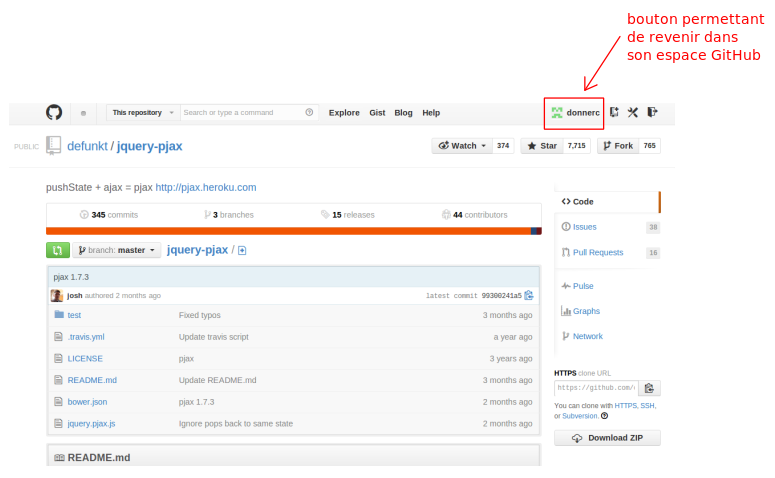
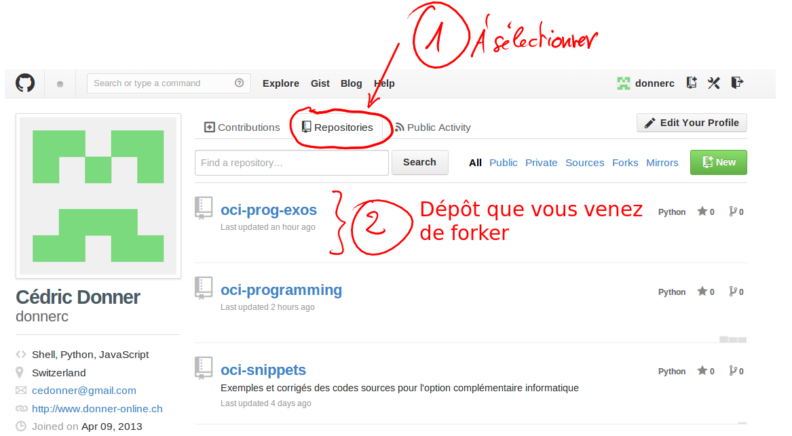

..	_premiere-utilisation-github:

Première utilisation de GitHub
##############################

Ce petit guide va vous conduire dans votre première utilisation de GitHub et
en faire une brève présentation générale.

*GitHub* est une sorte de Facebook de la programmation. La plupart des plus
grands programmeurs de la planète ont un compte sur GitHub et ce dernier fait
en quelque sorte office de "carte de visite" du programmeur.

GitHub est une interface au programme **git** créé par Linus Torvalds, le
créateur du système d'exploitation libre et gratuit GNU Linux. Il est bien
clair que Torvalds n'était pas le seul dans cette grande aventure : il a
collaboré avec des milliers de personnes grâce au **système de contrôle de
version distribué** *git*. La majorité des grands projets informatiques actuels
dans le monde du logiciel libre utilisent l'outil *git* pour gérer le
développement du code source et la collaboration entre les développeurs.

Il s'agit d'un outil permettant de partager le code source (les fichiers
contenant les lignes de programmation) d'un projet et de gérer les différentes versions des fichiers. Cet outil conserve tout l'historique des modifications de chaque fichier présent dans le projet, ce qui rend possible à tout moment la restauration des versions antérieures.

Nous allons également nous servir de cet outil dans le cadre de l'OC
informatique pour partager les solutions des exercices et, plus tard,
développer nos projets.

..	note::

	Pour les personnes travaillant déjà sur un projet, dans le cadre du TM
	développement Web, vous pourrez également vous servir de cette plateforme
	pour coder ensemble sur les mêmes fichiers HTML, CSS et PHP.

S'identifier
=============

#)	Pour s'identifier, il faut cliquer sur le  bouton "sign in"

	..	figure:: figures/github-se-logger-01.png
		:align: center
		:width: 90%

    	Bouton "Sign In"

#)	Entrer ensuite vos informations de connexion créées lors du
	premier cours de l'année.

..	note::

	Github est gratuit pour les projets publics et ne devient payant que pour les projets gardés privés. 

	Dans l'OC informatique, nous travaillerons uniquement sur des projets
	publics. Tous vos exercices seront donc automatiquement disponibles à tout
	le monde sur Internet.

Écran d'accueil
===============

Voici quelques explications concernant l'écran d'accueil de votre compte
GitHub. Naturellement, il n'y a pas encore de dépôts dans votre compte lors de
sa création ...

	Écran d'accueil

Nous n'allons évidemment pas immédiatement utiliser toutes les fonctionnalités de GitHub.

Forker un dépôt
===============

Avant de créer un dépôt, nous allons commencer par "forker" un dépôt existant. Pour ce faire, vous allez visiter le dépôt https://github.com/donnerc/oci-prog-exos. 

..	note::

	L'opération de bifurcation (*fork* en anglais) consiste à copier un dépôt
	dans lequel on va apporter des modifications pour ne pas toucher au dépôt
	original.

	Ceci est une des opérations les plus fondamentales avec git et permet très facilement à un développeur de créer une nouvelle mouture d'un logiciel informatique créé par d'autres développeurs.

	Après la bifurcation, si le dépôt original évoluel, il est possible
	d'importer très facilement ces modifications dans le "fork". Nous verrons
	plus tard les commandes *git* permettant d'effectuer ceci.

Ce dépôt (*repository* en anglais) contient des fichiers de base pour les problèmes de france IOI. 

	Créer une bifurcation

Travailler avec un dépôt
========================

Il y a de nombreuses façons de travailler avec un dépôt git. La plus commune
est de "cloner" le dépôt sur votre machine locale, de modifier les fichiers à
l'aide d'un éditeur de texte installé sur votre machine locale et de gérer ces
modifications à l'aide de la commande ``git``.

Pour le moment, nous allons utiliser le site de GitHub modifier les fichiers
présents dans le dépôt. Pour ce faire, faut commencer par vous rendre dans
votre propre espace GitHub. Pour ce faire, il suffit de cliquer sur le bouton qui porte le nom de votre compte en haut à droite de la page : 

	Retourner à son espace personnel

Depuis l'accueil de votre espace personnel, il est possible de voir tous vos
dépôts, en particulier celui que vous venez de *forker* :

	Liste des dépôt personnels

Navigation dans le code source
------------------------------

Vous pouvez entrer dans votre copie du dépôt en cliquant dessus dans la liste. Ceci devrait vous conduire à une URL qui ressemble à 
https://github.com/votre-compte-gihub/oci-prog-exos :

	Page d'accueil d'un dépôt

Je vous laisse naviguer un peu dans le code source de dépôt. Il contient essentiellement les fichiers python à compléter pour rendre vos devoirs.

Structure de ce dépôt
=====================

Le texte suivant montre la structure des fichiers présents dans le niveau 01 de france IOI (dans l'ordre décroissant des chapitres) :

..	literalinclude:: structure-niveau-01.txt
	:language: bash

Contenu des fichiers
--------------------

Pour le moment, les fichiers se ressemblent beaucoup et ne contiennent que
certaines informations concernant chaque exercice. Il sera de votre ressort de
compléter ces fichiers avec le code Python soumis au serveur d'évaluation de
France IOI.

Chaque fichier se présente en gros sous la forme suivante et contient en
particulier l'URL où se trouvent la donnée du problème sur le site de France IOI.

::

	##################################
	# fichier calcul-des-denivelees-entrainement.py
	# nom de l'exercice :  Calcul des dénivelées
	# url : http://www.france-ioi.org/algo/task.php?idChapter=647&idTask=0&sTab=task&iOrder=4
	# type : entrainement
	#
	# Nom du chapitre : 
	#
	# Compétence développée : 
	#
	# auteur : 
	##################################

	# chargement des modules

	# mettre votre code ici

