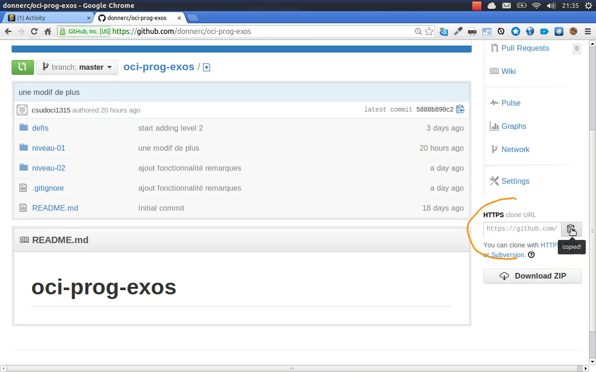
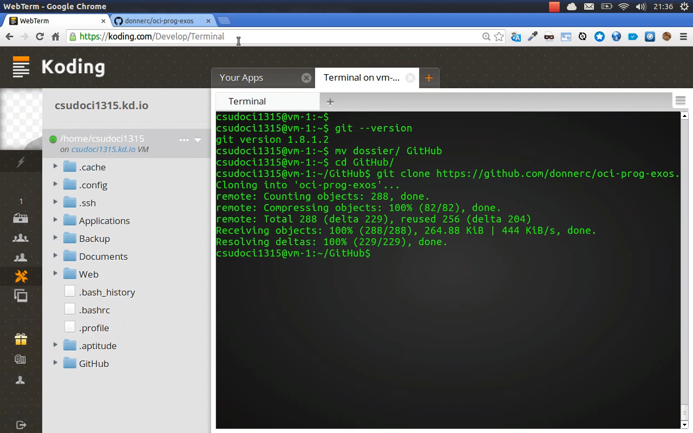

.. |koding| replace:: http://koding.com

..  _koding-tuto-02:

Installater *git* et clôner le dépôt ``oci-prog-exos``
######################################################

Maintenant que vous savez entrer des commandes dans le terminal pour créer des
dossiers et y naviguer, nous allons voir comment installer, des paquets
logiciels sous Linux Ubuntu, à commencer par l'utilitaire *git*

..  tip::

    * Je vous rappelle qu'il faut impérativement visionner les vidéos (peut-être plusieurs fois) et qu'il faut effectuer les opérations en même temps. 

    * N'hésitez donc pas à mettre la vidéo en pause. 

    * Le résumé ne fait que reprendre les éléments essentiels de la vidéo mais
    constitue en aucun cas un remplacement

..  only:: html

    Démonstration vidéo
    ===================

    ..  youtube:: PCD6FBYlrCc
        :width: 100%

Résumé
======

Installer *git*
---------------

Pour installer l'utilitaire *git*, il faut exécuter la commande ``apt-get``
permettant de gérer les **paquets logiciels** installés sur la machine. Vous
allez voir qu'il est bien plus simple d'installer un logiciel sous Linux
Ubuntu que sous Windows (ou Mac OS X).

Essayons de saisir la commande suivante :

::

    apt-get install git

Le retour est immédiat :

::

    E: Could not open lock file /var/lib/dpkg/lock - open (13: Permission denied)
    E: Unable to lock the administration directory (/var/lib/dpkg/), are you root?

En gros, le système nous dit ``permission denied`` pour nous signifier que
nous n'avons pas le droit d'installer un logiciel sans être administrateur.

Dans les systèmes UNIX, on peut momentanément acquérir les droits
administrateurs (on dit "super-utilisateur" dans le jargon UNIX) en faisant
précéder la commande à exécuter par ``sudo`` :

::

    sudo apt-get install git

..  note::

    Le mot de passe à entrer est le mot de passe du site Koding.com. Lorsque
    vous le taperez au clavier, il ne s'affichera pas, c'est tout-à-fait
    normal.

Et là, toute la magie de ``apt-get`` opère pour nous installer *git* en un
clin d'oeil. Essayez d'installer *git* sous Windows pour apprécier la
différence ...

Créer un dossier ``GitHub``
---------------------------

Avant de clôner votre dépôt, vous allez première créer un dossier ``GitHub``
dans votre dossier personnel sur |koding| avec la commande ``mkdir`` et vous y
rendre avec la commande ``cd``

::

    mkdir GitHub
    cd GitHub

La solution montrée dans la vidéo renomme le dossier ``dossier`` créé dans la
précédente vidéo :

::

    mv dossier GitHub
    cd GitHub

..  admonition:: Syntaxe commande ``mv``

    ::

        mv fichier_initial fichier_destination

..  note::

    La commande ``mv`` permet de renommer un fichier ou un dossier. En fait,
    ``mv`` = "Move" et sert à la base à déplacer des fichiers et dossiers dans
    le système de fichiers. 

    Par la force des choses, elle sert également à renommer un fichier/dossier puisque renomme = déplacer au même endroit mais sous un autre nom.

Clôner votre dépôt ``oci-prog-exos`` depuis GitHub
---------------------------------------------------

Maintenant que vous vous trouvez dans le dossier ``/home/<login>/GitHub``, vous pouvez clôner votre dépôt à l'aide de la commande *git* 

::

    git clone <url_depot>

où ``<url_depot>`` est l'url du dépôt qui peut être relevée sur la page GitHub
du dépôt dans la barre de droite, comme illustré sur la figure ci-dessous

    Trouver l'URL du dépôt sur le site GitHub

    Commande à entrer dans le terminal à l'intérieur du dossier ``GitHub``

..  admonition:: TODO

    Clôner votre dépôt avec la commande suivante en replaçant la partie ``<login>`` par votre login GitHub :

    ::

        git clone https://github.com/<login>/oci-prog-exos.git

    ..  note::

        En sélectionnant l'URL de votre dépôt sur GitHub, faites bien
        attention de prendre la méthode HTTPS et non SSH. En effet, l'URL SSH
        demande des configurations supplémentaires pour fonctionner
        correctement.

    Ceci devrait avoir créé un dossier ``oci-prog-exos`` dans lequel vous trouverez votre dépôt

    ..  figure:: figures/git-repo-cloned.png
        :width: 70%
        :align: center

        Résultat de l'opération de clônage du dépôt

