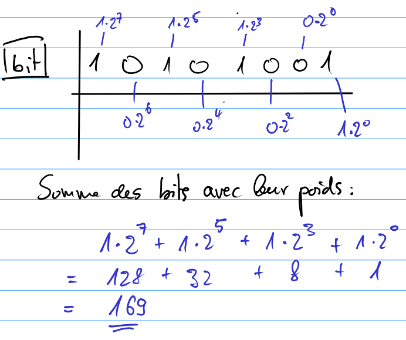

..  _notion-conversion-binaire-decimal:

Représentation binaire des nombres
##################################

..  note::

    Dans cette petite section, on présente la manière dont un ordinateur
    encode les nombres sous forme de bits. En clair, nous allons voir comment
    convertir une chaine de caractères binaires telle que

    ::

        010100010001110

    en un nombre décimal compréhensible par un humain 

Représentation des nombres entiers
==================================

    Exemple de conversion de nombre binaire en décimal

On voit dans l'illustration que les bits de gauche sont les **bits de poids
fort** alors que les placés à droite sont les **bits de poids fort**. Cela veut dire que le bit tout à droite a un poids de :math:`2^0 = 1` alors que le bit de gauche a un poids de :math:`2^7= 128` . La nombre binaire :math:`10101001` vaut donc

..  math:: 1\times 2^7 + 0\times 2^6 + 1\times 2^5 + 0\times 2^4 + 1\times 2^3 + 0\times 2^2 + 0\times 2^2 + 1\times 2^0 \\= 128 + 32 + 8 + 1 \\= 169

..  _notion-conversion-binaire-decimal-exercice-1:

Exercice 1
----------

Convertir en représentation décimale les nombres binaires suivants :

#)  :math:`1001`
#)  :math:`10110110`

..  _notion-conversion-binaire-decimal-exercice-2:

Exercice 2
----------

Parmi les nombres binaires suivants, indiquer ceux qui sont pairs :

#)  :math:`0000000010`
#)  :math:`0000000001`
#)  :math:`1001010010001110010010001001001111000101`
#)  :math:`1001010010001110010010001001001111000110`

..  _notion-conversion-binaire-decimal-exercice-3:

Exercice 3
----------

..  admonition:: Donnée

    Créer un programme nommé ``bin2dec.py`` qui lit sur l'entrée standard une chaine de caractères représentant un nombre binaire et qui affiche sur la 
    sortie standard la représentation décimale du nombre en question.

..  admonition:: entrée

    ::

        00101010

..  admonition:: Sortie

    ::

        42

..  tip::

    #)  On peut parcourir une chaine de caractères avec la structure

        ::

            for caractere in chaine:
                # faire quelque chose avec chacun des caracteres
                # composant la chaine
                print(caractere)

        Par exemple, on peut tester l'interaction suivante dans Python : ::

            for bit in '00101010':
                print(bit)

        qui produit la sortie ::

            0
            0
            1
            0
            1
            0
            1
            0

    #)  On peut déterminer le nombre de caractères contenus dans une chaine avec
        la fonction intégrée ``len`` intégrée au langage Python : ::

            >>> len('salut')
            5
            >>> len('')
            0
            >>> len('00101010')
            8

