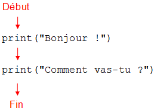

Chapitre 1 -- Affichage de texte, suite d'instructions
####################

Afficher du texte
=================

En Python, pour afficher du texte, on écrit print puis, entre parenthèses, le texte à afficher, entre guillemets. Ainsi, pour afficher le mot ``bonjour``, on écrit :

::

	print("bonjour")

Une ligne d'un programme est appelée une **instruction**.

Un texte apparaissant dans un programme entre des guillemets s'appelle une **chaîne de caractères**.

Afficher du texte : erreurs possibles
=====================================

Lorsqu'on écrit un programme informatique il faut être très rigoureux car sinon l'ordinateur ne comprend pas ce qu'on lui demande et affiche des erreurs.

Face à une erreur, il faut d'abord lire et comprendre le message d'erreur et ensuite relire attentivement la zone de code concernée, en particulier pour s'assurer qu'il ne manque pas de symbole tel qu'une parenthèse ou un guillemet.

Voici quelques exemples de messages d'erreurs.

Attention aux parenthèses !
---------------------------

Si on oublie les parenthèses, cela produit une des erreurs suivantes :

::

	>>> print("bonjour"
	SyntaxError: unexpected EOF while parsing

	>>> print "bonjour")
	SyntaxError: invalid syntax

Attention aux guillemets !
--------------------------

Si on oublie un ou plusieurs guillemets, cela produit une des erreurs suivantes :

::

	>>> print("bonjour)
	SyntaxError: EOL while scanning string literal

	>>> print(bonjour)
	NameError: name 'bonjour' is not defined

	>>> print(bonjour tout le monde)
	SyntaxError: invalid syntax

Conclusion
----------

Il faut juste être précis et ne rien oublier. Si l'on rencontre une erreur on pensera à bien tout vérifier. Les messages d'erreur vous indiquent très souvent la source exacte du problème, il faut les lire et essayer de comprendre leur signification.

Les messages d'erreurs vous donneront aussi toujours le numéro de la ligne à laquelle l'erreur s'est produite. Ce numéro n'est pas toujours exact mais vous donne une bonne idée d'où chercher votre erreur.

Afficher plusieurs lignes de texte
==================================

Pour faire effectuer plusieurs choses à un programme, on place les différentes instructions les unes en dessous des autres. On peut ainsi afficher plusieurs lignes de texte.

Voici un exemple complet.

::

	print("Bonjour !")
	print("Comment vas-tu ?")

::

	Bonjour ! 
	Comment vas-tu ? 

On peut représenter l'exécution de cet exemple par le diagramme suivant.

	Séquence de deux instructions

Afficher du texte sans retour à la ligne
========================================

L'instruction 

::

	print("Bonjour")

effectue en fait deux choses distinctes :

*	premièrement, afficher le mot "Bonjour",
*	deuxièment, passer à la ligne suivante ou, autrement dit, effectuer un retour à la ligne.

Bien qu'il soit généralement pratique de faire en une seule instruction un affichage et un retour à la ligne, il peut également être utile de pouvoir effectuer chaque tâche indépendamment.

Pour afficher le mot "Bonjour" sans le suivre d'un retour à la ligne, on utilise la commande suivante :

::

	print("Bonjour", end = "")

Le texte qui suit le "Bonjour" est une option qui permet de dire que l'on ne veut rien faire du tout après avoir affiché "Bonjour".

Pour vérifier que le retour à la ligne n'est pas effectué, exécutons deux fois de suite l'instruction en question.

::
	
	print("Bonjour", end = "")
	print("Bonjour", end = "")

Ce programme affiche le mot "Bonjour" deux fois de suite sur la même ligne, sans aucun espacement entre les deux.

::
	
	BonjourBonjour 

Il nous reste à expliquer comment aller à la ligne sans rien afficher du tout. Pour cela, il suffit d'utiliser l'instruction print en lui disant d'afficher un texte vide :

::

	print("")

Cette instruction demande donc d'afficher un texte vide puis de revenir à la ligne : elle n'affiche donc rien mais revient à la ligne.

Le programme suivant illustre l'utilisation de cette instruction :

::

	print("Un ", end = "")
	print("deux ", end = "")
	print("trois ", end = "")
	print("")
	print("Soleil ! ")

::

	Un deux trois  
	Soleil ! 