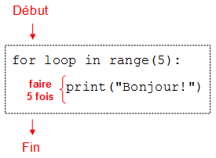

Chapitre 2 -- Répétitions d'instructions
####################

Répéter une action
==================

Considérons une tâche répétitive, par exemple dire 5 fois "Bonjour !". Il est tout à fait possible d'écrire le programme suivant :

::

    print("Bonjour !")
    print("Bonjour !")
    print("Bonjour !")
    print("Bonjour !")
    print("Bonjour !")

Néanmoins, c'est très fastidieux ! Imaginez s'il avait fallu l'afficher 1000 fois !

Pour éviter de recopier plusieurs fois une instruction que l'on veut exécuter plusieurs fois, on peut utiliser le principe de la boucle. Ainsi, pour répéter 5 fois l'instruction qui affiche "Bonjour !" on va écrire le programme ci-dessous.

::

    for loop in range(5):
        print("Bonjour !")

qui donne la sortie ::

    Bonjour ! 
    Bonjour ! 
    Bonjour ! 
    Bonjour ! 
    Bonjour ! 

On peut représenter l'exécution du programme par le diagramme suivant :

    Principe de la boucle 'répéter :math:`n` fois'

Pour réaliser ce programme, on a utilisé la structure suivante :

::

    for loop in range(5):
        ...

qui signifie "répéter 5 fois".

On expliquera plus tard pourquoi une boucle s'écrit ainsi. En attendant on retiendra qu'une boucle s'écrit comme au-dessus, en remplaçant simplement le chiffre "5" par le nombre de répétitions souhaitées. On fera également attention à bien mettre les deux points à la fin.

On a donc, dans le programme ci-dessus, remplacé les "..." par l'instruction à répéter en prenant bien soin de la décaler de trois espaces vers la droite.

Le décalage de trois espaces vers la droite s'appelle une indentation. Cette indentation est obligatoire car elle sert à indiquer quelle(s) instruction(s) répéter dans la boucle.

Remarque sur l'indentation
--------------------------

Avec l'éditeur utilisé sur le site, il vous suffit d'appuyer sur la touche "Tabulation" de votre clavier pour décaler un texte de 3 espaces, pas besoin d'appuyer trois fois sur la touche espace.

Répétition : erreurs possibles
==============================

Il est facile de se tromper dans les boucles lorsqu'on n'a pas l'habitude. Ainsi, si l'on oublie le ":" à la fin de la ligne, on obtient une erreur :

::
    
    for loop in range(5)
       print("Bonjour !")

::

    SyntaxError: invalid syntax

Et si l'on oublie d'indenter, c'est-à-dire si on oublie les trois espaces, on obtient également une erreur :

::
    
    for loop in range(5):
    print("Bonjour !")
    
    SyntaxError: expected an indented block

Face à ce type d'erreur, on pensera donc à bien vérifier que les deux-points sont bien présents et que l'indentation a été faite.

Répéter plusieurs actions
=========================

Il est souvent utile de répéter un groupe de plusieurs instructions, et non pas seulement une seule instruction. Par exemple, supposons que l'on veuille afficher :

::

    Bonjour ! 
    Comment vas-tu ? 
    Bonjour ! 
    Comment vas-tu ? 

On peut écrire un programme qui affiche ce texte à l'aide d'une boucle qui répète deux instructions à chaque fois. Pour obtenir cela, il suffit d'indenter les deux instructions à répéter, comme montré ci-dessous : ::

    for loop in range(2):
       print("Bonjour !")
       print("Comment vas-tu ?")

::

    Bonjour ! 
    Comment vas-tu ? 
    Bonjour ! 
    Comment vas-tu ? 

Si l'on indente la première instruction d'affichage mais pas la seconde, on obtient un programme différent où seule la première instruction est répétée deux fois, tandis que la seconde n'est exécutée qu'une seule fois :

::

    for loop in range(2):
       print("Bonjour !")
    print("Comment vas-tu ?")

::

    Bonjour ! 
    Bonjour ! 
    Comment vas-tu ? 

En conclusion, il est très important de bien faire attention à indenter toutes les instructions qui doivent être répétées, et uniquement celles-là.

Répétition : cohérence de l'indentation
=======================================

Attention à toujours utiliser 3 espaces pour indenter le code. Si l'indentation n'est pas toujours la même, vous obtiendrez une erreur :

::

    for loop in range(2):
       print("Bonjour !")
      print("Comment vas-tu ?")

::

    SyntaxError: unindent does not match any outer indentation level

Répéter de manière imbriquée
============================

Nous avons vu comment les boucles permettent de répéter une action donnée. Là où ça devient vraiment puissant, c'est qu'il est possible de répéter une action qui elle-même répète une action.

Par exemple, imaginons qu'on souhaite écrire un programme dessinant un rectangle rempli de X, haut de 5 lignes et large de 10 colonnes, c'est-à-dire :

::

    XXXXXXXXXX 
    XXXXXXXXXX 
    XXXXXXXXXX 
    XXXXXXXXXX 
    XXXXXXXXXX 

Il nous faut donc un programme qui va répéter 5 fois les deux choses suivantes :

#   répéter 10 fois l'affichage d'un caractère ``X``, sans retour à la ligne,
#   passer à la ligne suivante.
Il nous faut donc écrire une boucle dans une boucle !

On arrive donc au programme suivant :

::

    for loop in range(5):
       for loop in range(10):
          print("X", end = "")
       print("")

Étudions de plus près le code du programme. Il débute par une instruction de répétition :

::

    for loop in range(5):

qui va répéter tout le bloc de code suivant :

::

    for loop in range(10):
       print("X", end = "")
    print("")

Ce bloc contient lui-même une instruction de répétition :

::

    for loop in range(10):

Et cette instruction s'applique uniquement à l'instruction qui affiche un ``X`` :

::

    print("X", end = "")

On peut représenter l'exécution du programme par le diagramme suivant :

..  figure: figures/diagram_repeat_included_fr_python.png

    Deux boucles l'une dans l'autre

Lorsqu'une boucle apparaît à l'intérieur d'une autre boucle, comme c'est le cas ici, on parle de boucle imbriquée.

