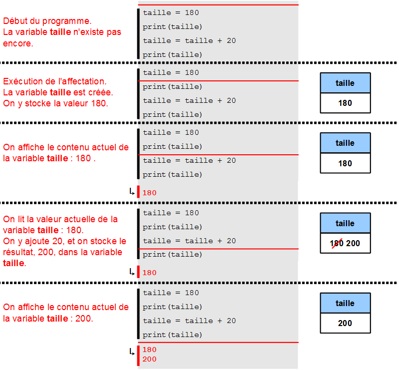

Chapitre 3 -- calculs et variables
##################################

Mémoriser des informations
==========================

Principe
--------

Supposons que l'on souhaite écrire un programme qui affiche d'abord la distance qui séparait la Terre et Mars le 27 Août 2003 (55'758'000 km), puis la distance à parcourir par la lumière pour faire l'aller-retour depuis la Terre (le double). On pourrait écrire le programme ainsi :

 

::

    print(55758000)
    print(2 * 55758000)

::

    55758000 
    111516000 

Ce programme fonctionne parfaitement bien, mais il n'est pas idéal car on a dû écrire deux fois le nombre ``55758000`` dans le code du programme. Cela signifie que si on veut afficher ces informations pour un autre jour, pendant lequel la distance entre les deux planètes est différente, il faudra modifier le programme à deux endroits différents.

Pour éviter de devoir faire des modifications en double, on va utiliser une **variable**, appelée ``distance``, pour stocker la valeur ``55758000``. Grâce à cette variable, on peut réécrire le programme précédent en ne faisant apparaître qu'une seule fois le nombre ``55758000`` :

::

    distance = 55758000
    print(distance)
    print(2 * distance)

::

    55758000 
    111516000

Le programme fonctionne exactement comme avant. Peu importe qu'il soit un peu plus long, ce qui compte vraiment, c'est qu'on a maintenant deux fois moins de chance de se tromper lorsqu'on modifie la distance.

On peut voir une variable comme une boîte qui porte un nom et qui contient quelque chose : on peut y stocker des informations et les retrouver plus tard. Dans notre exemple, la boîte porte le nom ``distance`` et contient la valeur ``55758000``.

Une boîte contenant un nombre

La boîte ``distance`` a été créée par l'instruction suivante, qui s'appelle une **affectation** :

::

    distance = 55758000

Les deux instructions d'affichage ont consulté le contenu de la boîte distance pour y lire la valeur ``55758000``.

::

    print(distance)
    print(2 * distance)

Règles pour choisir les noms des variables
-------------------------------------------

Lorsqu'on a besoin d'une nouvelle variable, on cherchera toujours à trouver un nom pour cette variable qui décrive le mieux possible ce que représente la valeur contenue dans cette variable. Il ne faut pas hésiter à mettre à la suite plusieurs mots pour construire un nom précis. Nous vous conseillons de nommer vos variables par une suite de mots ou abréviations accolés les uns aux autres, en mettant en majuscule la première lettre de chaque mot (sauf le premier). Voici quelques exemples :

::

    longueurFeuille
    nbPiecesJaunes
    maxHauteurPiquets

En particulier, on évitera l'utilisation de noms réduit à une simple lettre, comme ``a`` ou ``a``. Par exemple, le programme suivant est un exemple de très mauvais code :

::

    a = 1000
    b = 50
    c = a + b

En effet, on comprend beaucoup mieux ce qui se passe lorsque des noms plus parlants sont employés :

::

    prixFour = 1000
    prixBatteur = 50
    prixTotal = prixFour + prixBatteur

Noms valides et invalides
--------------------------

En Python, le nom d'une variable peut être choisi "presque" librement. Il faut retenir les règles suivantes :

*   Le premier caractère du nom d'une variable ne peut pas être un chiffre. Le nom  
    ``1erNombre`` est ainsi invalide.
*   Certains mots font partie du langage Python et ne peuvent être utilisés pour
    nommer des variables. C'est par exemple le cas du mot ``for``.
*   Les caractères autorisés sont essentiellement les chiffres de '0' à '9', le caractère '_', et les lettres majuscules ou minuscules.

Plusieurs variables
-------------------

Dans l'exemple ci-dessus, nous avons utilisé une seule variable, mais les programmes en utilisent généralement plusieurs. Le programme suivant illustre cela : il utilise deux variables nommées ``largeur`` et ``longueur`` afin de calculer l'aire, en :math:`[\text{mm}^2]` d'une feuille A4 (21cm x 29,7cm), et il enregistre le résultat dans une variable nommée surface. Le contenu de cette variable est ensuite affiché.

::

    largeur = 210
    longueur = 297

::

    surface = longueur * largeur
    print(surface)

::

    62370 

Erreurs fréquentes
==================

Débogage : variables inexistantes
---------------------------------

Si on utilise une variable qui n'existe pas encore, on obtient une erreur. Par exemple, le programme suivant définit une variable longueur, et tente ensuite d'afficher le contenu d'une variable nommée largeur qui n'a jamais été définie. ::

    longueur = 297
    print(largeur)

::

    NameError: name 'largeur' is not defined

Il faut faire particulièrement attention au fait que les minuscules et majuscules ne sont pas considérées comme équivalentes. Ainsi, la variable nommée longueur n'a strictement rien à voir avec la variable nommée Longueur.

::

    longueur = 10
    print(Longueur)

::

    NameError: name 'Longueur' is not defined

Si on rencontre une erreur de la forme ``NameError: name 'xxxxx'`` is not defined, on pensera à bien vérifier que l'on n'a pas fait de faute de frappe dans les noms de variables que l'on a utilisés dans le programme.

Modifications d'une variable
----------------------------

Comme son nom l'indique, une variable a vocation à varier, c'est-à-dire à stocker différentes valeurs au cours du temps. Pour illustrer cette possibilité, considérons un programme qui utilise une variable nommée taille pour représenter la taille d'une plante qui a pour taille initiale 180 cm et qui grandit ensuite de 20 cm. Ce programme, dont le code apparaît ci-dessous, affiche d'abord la taille initiale de la plante, puis sa taille finale (200 cm).

Le programme

::

    taille = 180
    print(taille)
    taille = 200
    print(taille)

produit la sortie

::

    180 
    200

Encore une fois, on a un programme qui fonctionne correctement, mais qui n'est pas idéal. En effet, si l'on veut modifier la taille initiale de la plante, on est obligé de modifier deux valeurs dans le code programme.

Pour éviter ce problème, on va modifier le code du programme pour calculer la taille finale en ajoutant 20 cm à la taille initiale. L'instruction ci-dessous permet de modifier le contenu de la variable taille en le remplaçant par son contenu actuel augmenté de 20.

::

    taille = taille + 20

Observez que le symbole d'égalité n'a pas du tout la même signification qu'en mathématiques. En mathématiques, l'égalité énonce un fait. Ainsi :math:`x = y + z` signifie qu'il est vrai maintenant et pour toujours que x a la même valeur que y + z. Au contraire, dans une affectation telle que ``taille = taille + 20``, on décrit une action, en indiquant qu'il faut enregistrer dans la variable dont le nom est écrit à gauche du signe égal le résultat du calcul écrit à droite du signe ``=``.

En utilisant l'affectation ``taille = taille + 20``, on peut réécrire notre programme en n'utilisant que les nombres ``180`` et ``20`` (une seule fois chacun).

::
    taille = 180
    print(taille)
    taille = taille + 20
    print(taille)

Sortie :

::

    180 
    200 

L'exécution de ce programme est détaillée ci-dessous, la ligne rouge indiquant à quel endroit du programme on est arrivé :

    Exécution du programme ligne après ligne

Modification d'une variable mal nommée
--------------------------------------

Comme vous le savez, les noms de variables font la distinction entre majuscules et minuscules. Cependant, quand on se trompe, on n'obtient pas forcément une erreur de la forme ``"truc is not defined"``. Parfois, le programme peut faire tout simplement autre chose que ce que l'on voudrait !

Par exemple, le programme suivant contient une petite erreur à la troisième ligne, car on a mis ``Taille`` au lieu de ``taille``.

::

    taille = 180
    print(taille)
    Taille = taille + 20
    print(taille)

Au lieu d'afficher ``180`` puis ``200``, comme on voudrait, le programme modifié affiche deux fois de suite le nombre ``180``.

::

    180 
    180

Aucun message d'erreur ne nous prévient que l'on s'est trompé ! Pourtant, il est très facile de se tromper de la sorte, en particulier parce qu'on a l'habitude de commencer les lignes par des majuscules.

..  tip::

    Pour éviter ce genre de problème, on adoptera la convention de toujours faire commencer les noms de variables par une lettre minuscule.