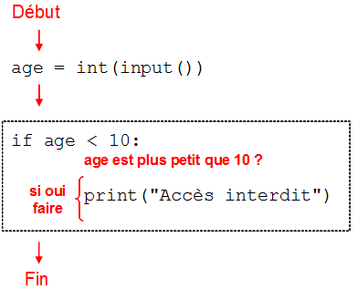
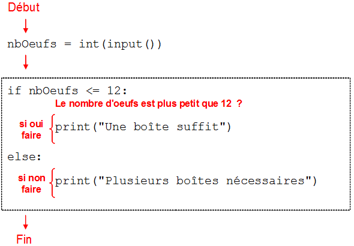

Chapitre 5 : Tests et conditions
################################

Tester une condition : le "si"
==============================

La célèbre attraction du train fou est interdite aux moins de 10 ans. On souhaite écrire un programme qui demande à l'utilisateur son âge et qui, si la personne a moins de 10 ans, affiche le texte "Accès interdit". Dans cette phrase on a utilisé le mot "si", on va voir comment cela se traduit en Python :

::

	age = int(input())
	if age < 10:
	   print("Accès interdit")

On écrit donc le mot-clef ``if``, la traduction en anglais de "si", la condition à tester, à savoir ``age < 10``, puis on termine la ligne avec un deux-points, comme on le faisait pour la boucle de répétition.

Ainsi, l'accès est interdit à un enfant de 8 ans :

..	admonition:: Entrée

	::

		8

..	admonition:: Sortie

	::

		Accès interdit 

Au contraire, le programme n'affiche rien pour un âge de 13 ans.

..	admonition:: Entrée

	::

		13

..	admonition:: Sortie

	::

On peut représenter l'exécution du programme par le diagramme suivant :

	Test d'une condition et exécution conditionnelle

Pour exprimer la condition du ``if`` dans ce programme, on a utilisé le symbole ``<``, qui est l'opérateur de comparaison strictement inférieur.

On a vu que l'opérateur ``<`` permet de tester si un nombre est strictement inférieur à un autre. De manière symétrique, l'opérateur ``>`` permet de tester si un nombre est strictement supérieur à un autre.

Lorsqu'on veut tester si un nombre est inférieur ou égal à un autre, on utilise le symbole ``<=``. De manière symétrique, le symbole ``>=`` permet de tester si un nombre est supérieur ou égal à un autre.

Par exemple, le code suivant permet de tester si la température de l'eau a atteint 100 degrés.

::

	temperature = int(input())
	if temperature >= 100:
	   print("L'eau bout !")

Opérateurs de comparaison (résumé)
==================================

Voici un résumé des différents opérateurs de comparaison utilisables dans les conditions

..	list-table:: Opérateurs de comparaison
	:widths: 10, 40

	*	- ``a == b``
		- Vrai lorsque :math:`a = b`
	*	- ``a != b``
		- Vrai lorsque :math:`a \neq b`
	*	- ``a < b``
		- Vrai lorsque :math:`a < b`
	*	- ``a > b``
		- Vrai lorsque :math:`a > b`
	*	- ``a <= b``
		- Vrai lorsque :math:`a \leq b`
	*	- ``a >= b``
		- Vrai lorsque :math:`a \geq b`

Tester une condition : le "sinon"
=================================

Il arrive que l'on ait besoin de tester une condition puis son contraire. Par exemple, supposons que l'on souhaite tester si l'on peut ranger tous ses oeufs dans une seule boîte de 12. On pourrait programmer cela ainsi :

::

	nbOeufs = int(input())
	if nbOeufs <= 12:
	   print("Une boîte suffit")
	if nbOeufs > 12:
	   print("Plusieurs boîtes nécessaires")

Ce programme a donc traduit la phrase suivante : si le nombre d'oeufs est plut petit que 12 afficher "Une boîte suffit" et si c'est strictement supérieur à 12 afficher "Plusieurs boîtes nécessaires".

Cependant, cette phrase s'exprime plus simplement sous la forme suivante : si le nombre d'oeufs est plus petit que 12, afficher "Une boîte suffit", sinon afficher "Plusieurs boîtes nécessaires".

Il est possible d'exprimer en Python la notion de "sinon", ce qui évite de tester le contraire de la condition que l'on vient de tester. Plus précisément, il suffit d'insérer le mot clé ``else`` suivi d'un deux-points à l'endroit où l'on veut dire "sinon". Ainsi, le code précédent peut s'écrire de manière beaucoup plus élégante.

::

	nbOeufs = int(input())
	if nbOeufs <= 12:
	   print("Une boîte suffit")
	else:
	   print("Plusieurs boîtes nécessaires")

Il est important de toujours utiliser un ``else`` lorsque c'est possible. Cela permet non seulement d'éviter d'introduire des informations redondantes, comme par exemple ``nbOeufs <= 12`` et ``nbOeufs > 12``, mais aussi de rendre la logique du programme plus facile à comprendre.

On peut représenter l'exécution du programme par le diagramme suivant :

	Test d'une condition et exécution conditionnelle if/else

Blocs conditionels formés de plusieurs instructions
===================================================

On peut bien sur placer plusieurs instructions à la suite d'un test. L'exemple suivant permet d'afficher deux messages à la suite dans le cas où la température de l'eau est supérieure ou égale à 100 degrés.

::

	temperature = int(input())
	if temperature >= 100:
	   print("L'eau bout !")
	   print("Préparons le thé")

Il est très important d'indenter l'instruction qui affiche "Préparons le thé". Si l'on n'indente pas la seconde instruction, c'est-à-dire si l'on écrit :

::

	temperature = int(input())
	if temperature >= 100:
	   print("L'eau bout !")
	print("Préparons le thé")

ualors la phrase "Préparons le thé" va s'afficher quelque soit la température de l'eau, ce qui n'est pas ce que l'on souhaite ici.

Notez que, de la même manière, il est possible de placer plusieurs instructions dans un bloc ``else``.

Les opérateurs d'égalité et de différence
=========================================

Vous avez vu comment tester des inégalités strictes, à l'aide des opérateurs ``<`` et ``>``, ainsi que des inégalités larges, à l'aide des opérateurs ``<=`` et ``>=``. Voyons maintenant comment tester l'égalité ou la non-égalité de deux valeurs.

Par exemple, pour tester si Marie et Robin ont le même âge, on utilise l'opérateur ``==``, comme illustré ci-dessous.

::

	ageMarie = int(input())
	ageRobin = int(input())
	if ageMarie == ageRobin:
	   print("Marie et Robin ont le même âge")
	else:
	   print("Marie et Robin n'ont pas le même âge")

..	note::

	Il faut faire bien attention à ne pas confondre l'opérateur ``==`` avec le simple =, car les deux ont des rôles très différents :

	*	``=`` sert à affecter une valeur à une variable,
	*	``==`` sert à comparer deux valeurs dans un if.

Lorsqu'on veut uniquement tester si deux valeurs sont différentes, on utilise l'opérateur ``!=``, qui se lit "différent de". Par exemple, le code suivant affiche un message si un animal n'a aucune chance d'être une araignée car il n'a pas 8 pattes.

::

	nbPattes = int(input())
	if nbPattes != 8:
	   print("L'animal n'est pas une araignée")

