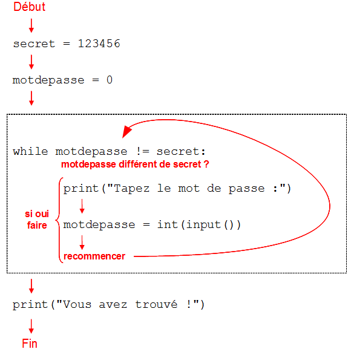

Chapitre 8 : Répétitions "tant que"
###################################

Faire la même chose plusieurs fois : le *"tant que"*
======================================================

On a parfois besoin de répéter certaines instructions sans savoir à l'avance
combien de fois il faudra le faire. Par exemple demander un mot de passe tant
que l'utilisateur n'a pas donné le bon.

On a ici utilisé dans la phrase le terme **"tant que"**, ce qui signifie qu'on
a bien une condition pour savoir quand s'arrêter mais on ne sait pas à
l'avance combien de fois la personne va se tromper !

Heureusement Python a une instruction **"tant que"**, que nous allons pouvoir
utiliser. Il s'agit de l'instruction ``while``, qui signifie **"tant que"** en
anglais.

::

	secret = 123456
	motdepasse = 0
	while motdepasse != secret:
	   print("Tapez le mot de passe : ")
	   motdepasse = int(input())
	print("Vous avez trouvé !")

Ainsi tant que la condition ``motdepasse != secret`` est vraie on continue à
demander un nouveau mot de passe.

On peut représenter l'exécution du programme par le diagramme suivant :

	Schéma d'exécution du while

Il est bien sûr possible d'utiliser des opérateurs booléens pour combiner des
conditions et les valeurs booléennes sont également utilisables. Voici
quelques extraits de code à titre d'exemple :

::

	while True:
	   print("J'attends")

Le premier de ces trois exemples est ce qu'on appelle une **"boucle
infinie"**, c'est-à-dire que le programme ne s'arrête jamais : comme ``True`` est
toujours vrai on ne quitte jamais le ``while``.

::

	while (motdepasse != secret) or agePersonne <= 3:
	   print("Accès refusé : mauvais mot de passe ou personne trop jeune")
	   agePersonne = int(input())
	   motdepasse = int(input())

::

	while nbPersonnes <= nbMax and temperature <= 45:
	   print("Portes ouvertes")
	   nbPersonnes = nbPersonnes + 1
	   temperature = int(input())

..	note::

	Nous parlions de **"boucle 'de répétition'"** pour désigner la structure
	``for loop``, nous parlerons de **"boucle 'tant que'"**, de **"boucle
	while"** ou tout simplement de **"boucle"** pour désigner la structure
	``while``.

Boucle infinie
==============

Dans un code utilisant une boucle *"tant que"* ou boucle *"while"*, si on
utilise une mauvaise condition, il est possible que le programme ne s'arrête
jamais, par exemple :

::

	valeur <- 1
	Tant que valeur <= 10 faire
	   valeur <- valeur - 1

Ici on a mis un ``-1`` au lieu d'un ``+1`` et du coup la variable valeur ne
fait que diminuer au lieu d'augmenter. Elle ne sera donc jamais plus grande
que ``10`` et le programme ne s'arrêtera jamais !

..	note::

	Si vous écrivez un tel programme, le système d'évaluation automatique du site
	vous indiquera que votre programme a *"dépassé la limite de temps"*. En effet,
	pour éviter les programmes qui ne s'arrêtent jamais, nous avons un système qui
	les bloque automatiquement s'ils mettent trop de temps à donner leur réponse.

	Si vous voyez un tel message, essayez de vérifier les conditions dans vos boucles.

..	note::

	Lorsqu'un programme ne s'arrête jamais car il est resté piégé dans une
	boucle, on dit de manière plus courte que le programme boucle.

la boucle while décortiquée
===========================

..	note::

	Il fortement conseillé de lire cette explication de la boucle while : 