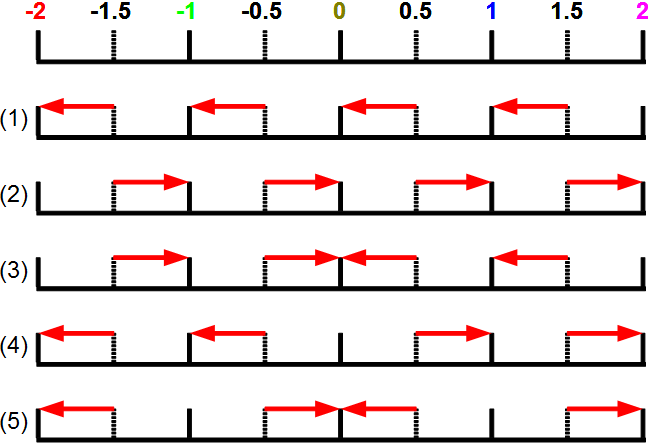

Faire des arrondis
##################

Arrondir un nombre décimal, c'est le transformer en un entier. Il existe
plusieurs manières de calculer des arrondis et nous en verrons deux dans ce
cours :

*   l'arrondi à l'entier inférieur,
*   l'arrondi à l'entier supérieur.

Par exemple, si on a une température de 12.3 degrès alors les deux arrondis
ci-dessus vont donner les valeurs 12 (entier inférieur) et 13 (entier
supérieur).

En Python pour calculer des arrondis il faut tout d'abord avoir importé le
module ``math`` :

::

    from math import *

Pour calculer les arrondis on utilise les fonctions ``floor`` et ``ceil``

::

    >>> # Entier inférieur (partie entière)
    >>> arrondiInf = floor(12.3)
    >>> print(arrondiInf)
    12
     
    >>> # Entier supérieur
    >>> arrondiSup = ceil(12.3)
    >>> print(arrondiSup)
    13

Attention si le nombre est négatif !

::

    >>> # Entier inférieur (partie entière)
    >>> arrondiInf = floor(-12.3)
    >>> print(arrondiInf)
    -13
    
     
    >>> # Entier supérieur
    >>> arrondiSup = ceil(-12.3)
    >>> print(arrondiSup)
    -12

Selon la situation, ce sera à vous de déterminer de quelle fonction d'arrondi
vous avez besoin.

..  tip::

Comment se souvenir des noms de ces fonctions ?

*   ``floor`` comme "floor" la traduction en anglais du mot "sol" : le sol est en bas, donc on arrondi à l'entier inférieur
*   ``ceil`` comme "ceiling" la traduction en anglais du mot "plafond" : le plafond est en haut, donc on arrondi à l'entier supérieur

..  note::

    Comme vous avez pu le voir, le résultat donné par ces fonctions est à
    chaque fois un entier et pas un nombre décimal représentant un entier. Dit
    autrement, on a bien "12" et pas "12.0" comme résultat.

Faire des arrondis (au plus proche)
===================================

Dans un précédent cours nous avons vu comment calculer un arrondi à l'entier
inférieur ou à l'entier supérieur. Nous allons maintenant voir comment
calculer un arrondi au plus proche pour lequel, de manière naturelle, la
valeur ``1.3`` sera arrondie à l'entier ``1`` et la valeur ``1.8`` sera arrondie à
l'entier ``2``.

Il ne faut pas oublier d'importer la bibliothèque de maths (comme pour les
fonctions ``floor()`` et ``ceil()``), ensuite il suffit d'utiliser la fonction
``round()`` :

::

    >>> arrondiPro = round(12.3)
    >>> print(arrondiPro)
    12 

Pour se souvenir du nom de cette fonction, penser que "round" est la
traduction en anglais du mot "arrondi".

Cas du 0.5 : différentes possibilités
-------------------------------------

Comment arrondir la valeur 1.5 ? Faut-il l'arrondir à 1 ou à 2 ? Il existe
plusieurs choix possibles avec tous une bonne justification. Voici les
principaux :

#)  **Au plus petit** : si deux choix sont possibles, prendre le plus petit.
#)  **Au plus grand** : si deux choix sont possibles, prendre le plus grand.
#)  **Vers zéro** : si deux choix sont possibles, prendre le plus proche de zéro.
#)  **Vers l'infini** : si deux choix sont possibles, prendre le plus éloigné de zéro.
#)  **Bancaire** : si deux choix sont possibles, prendre celui qui est pair.

Et en voici une illustration visuelle
-------------------------------------

L'arrondi bancaire est appelé ainsi car utilisé par les banques. En effet si
on ne regarde que les nombres positifs, tous les autres arrondis arrondissent
toujours dans la même direction : des petites erreurs pourraient s'accumuler.
En choisissant un arrondi qui va changer de direction selon la parité les
erreurs ne s'accumulent plus et vont se compenser naturellement.

Cas du :math:`0.5` : ce que fait Python
-------------------------------

Alors, quelle est la technique utilisée en Python ? Regardons sur quelques
valeurs !

::

    >>> print(round(-1.5))
    -2 
    >>> print(round(-0.5))
    0 
    >>> print(round(0.5))
    0 
    >>> print(round(1.5))
    2 

Il s'agit donc d'un arrondi "bancaire" quand il y a deux choix possibles.

..  note::

    En pratique le type d'arrondi utilisé pour calculer un arrondi au plus
    proche importe peu puisque les deux valeurs sont possibles, il s'agit
    juste d'une convention qui est prise dans un langage de programmation
    donné (ou en mathématique). Les exercices sur le site sont insensibles au
    type d'arrondi au plus proche utilisé.
