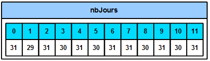

Les listes
##########

..	note::

	Ce que la théorie de France IOI appelle "tableau" est habituellement
	appelé "liste" dans le langage Python. France IOI appelle cela des
	tableaux car c'est ainsi que cette structure de données est appelée dans
	pratiquement tous les autres langages (C / C++ / Java / JavaScript / PHP /
	...)

Introduction aux tableaux
=========================

Imaginez que vous souhaitiez utiliser dans un programme un ensemble de
nombres, par exemple le nombre de jours de chaque mois de l'année. Une
première solution serait d'utiliser 12 variables :

::

	nbJoursJanvier = 31
	nbJoursFevrier = 29
	nbJoursMars = 31
	nbJoursAvril = 30
	nbJoursMai = 31
	nbJoursJuin = 30
	nbJoursJuillet = 31
	nbJoursAout = 31
	nbJoursSeptembre = 30
	nbJoursOctobre = 31
	nbJoursNovembre = 30
	nbJoursDecembre = 31
	print("Nombre de jours en Janvier :")
	print(nbJoursJanvier)

..	admonition:: Sortie

	::		

		Nombre de jours en Janvier : 
		31 

Plutôt long et répétitif, non ?

Comme vous le savez, une variable est comme une boîte qui permet de stocker de
l'information. Au lieu d'utiliser une boîte pour chaque mois de l'année, une
autre solution serait d'utiliser une seule grosse boîte appelée nbJours, et de
mettre plusieurs petites boîtes dans la grande. Pour pouvoir identifier ces
petites boîtes on leur donne alors un numéro. Ainsi on demandera à lire la
valeur de "la petite boîte numéro 5 située dans la boîte 'nbJours'".

	Schéma représentant la mémoire

Pour le moment vous avez vu différents type de variables qui peuvent contenir
différentes choses : des entiers, des booléens et des nombres à virgule. Il
existe un autre type de variable qui permet des stocker ces "petites boîtes"
identifiées par des numéros. Ces variables s'appellent des tableaux.

Les tableaux (communément appelés *listes* en Python)
-----------------------------------------------------

Pour créer un tableau, on utilise le code suivant :

::

	nbJours = [31, 29, 31, 30, 31, 30, 31, 31, 30, 31, 30, 31]

Ceci va créer un tableau nbJours contenant 12 valeurs entières.

Les positions de ces valeurs (les numéros des petites boîtes) vont de 0 (pour
la première) à 11 (pour la dernière). La numérotation démarre en effet à 0 en
Python.

On peut ensuite accéder aux éléments du tableau. Par exemple, le code suivant
affiche la valeur des éléments numéros 0 et 5 du tableau nbJours :

::
	>>> print(nbJours[0])
	31 
	>>> print(nbJours[5])
	30

Si on regarde à nouveau le code tout en haut, celui qui utilisait 12
variables, et qu'on regarde le code suivant qui fait la même chose mais en
utilisant des tableaux

::

	>>> nbJours = [31, 29, 31, 30, 31, 30, 31, 31, 30, 31, 30, 31]
	>>> print(nbJours[0])
	31

alors on voit très bien l'un des intérêts de ces tableaux : le code est
beaucoup plus court ! Imaginez si au lieu de mémoriser 12 éléments on avait
voulu en mémoriser 100 ou 1000 !

Les tableaux ont bien sur d'autres avantages et vous les découvrirez au fur et
à mesure des exercices.
